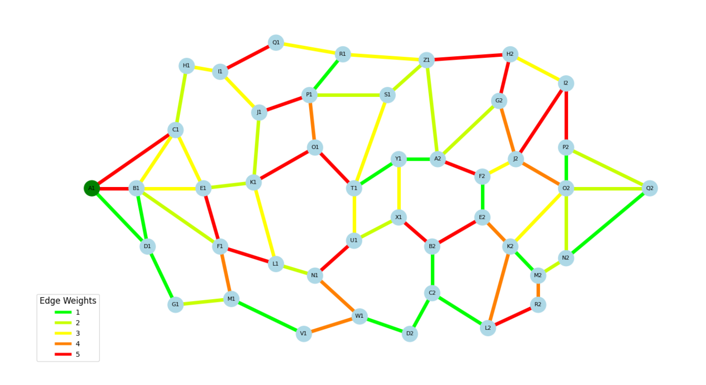

# Duck Quest - Board Game


*"Embark on a journey to teach children algorithmic thinking through a fun and interactive board game!"*

DuckQuest is an educational game created within a school project. It is aimed at young children and allows them to learn to think like an algorithm in order to understand how these work. We achieve this by asking them to find the shortest route through a graph, just as a Dijkstra algorithm would.

## Table of Contents

- [Overview](#overview)
- [Setup](#setup)
- [Installation](#installation)
- [Run](#run)
- [Tests](#tests)
- [License](#license)
- [Contact](#contact)

## Overview

### Game Concept
In DuckQuest, the graph is represented as a network of routes around a pond. Children guide a duck along the shortest path using physical buttons for graph nodes and LED strips for graph edges. A Raspberry Pi powers and controls the setup. 

### Example Visualization
Below is a sample graph with nodes and edges:



## Setup

### Graph Edge Colors
The LED strips light up in different colors to represent edge weights:

| Weight         | Color         |
|----------------|---------------|
| 1              | Green         |
| 2              | Bright-Green  |
| 3              | Yellow        |
| 4              | Orange        |
| 5              | Red           |
| Selected Path  | Cyan          |

### Hardware Requirements
To build the DuckQuest board game, you need the following components:

- Complete Raspberry Pi kit
- Push buttons for nodes
- Addressable RGB strips for edges (like WS2812)
- 5V Power Supply for powering the LED strip
- Jumper wires

## Installation

### Prerequisites

>⚠️ **Warning:** This project is designed for Raspberry Pi. If you run on another Linux system, some features (like GPIO) may not work.

Ensure you have the following software installed on your raspberry:

- [Python 3.6+](https://www.python.org/)
- [Git](https://git-scm.com/)
- An active graphical interface (like X11) – **required for running the game UI**

### Steps for Installation

1. Clone the repository on your Raspberry Pi:
   ```bash
   git clone https://github.com/LeoLeman555/Board_Game_DuckQuest.git
   ```

2. Navigate to the project directory:
   ```bash
   cd ./Board_Game_DuckQuest/
   ```

3. Create a virtual environment (recommended):
   ```bash
   python -m venv venv
   ```

4. Activate the virtual environment:
   - **Linux**:
   ```bash
   source venv/bin/activate
   ```
   - **Windows**:
   ```powershell
   venv\Scripts\activate
   ```

5. Installing dependencies with a Python script:
   ```bash
   python install.py
   ```

> **Why use `install.py` instead of `requirements.txt`?**  
> The `RPi.GPIO` module is specifically designed for Raspberry Pi and does not work on Windows or non-Raspberry Pi Linux systems.  
> If included directly in `requirements.txt`, installation would fail on unsupported platforms. 
> Additionally, the `rpi_ws281x` module, which is used to control the WS281x LED strips, is also Raspberry Pi-specific. Just like `RPi.GPIO`, it doesn't function on other platforms.
>  
> The `install.py` script ensures that both `RPi.GPIO` and `rpi_ws281x` are installed only if the script detects a Raspberry Pi. This makes the installation process more flexible and prevents errors on unsupported platforms.

6. You are fine !

## Run
To launch the game, use the following command:
```bash
sudo -E $(which python) -m src.main
```

## Tests
### Computer Game Modeling
1. Start the test suite:
   ```bash
   python -m tests.launch_game 
   ```
2. Interact with the GUI:
   - Press nodes to select the path.
   - Validate your selection to see if it matches the shortest path.
3. Example:


### Hardware Checker

This script tests both the button connected to the Raspberry Pi GPIO and an LED strip. The button press will change the LED strip's color to yellow.

#### How to Use

1. Connect the button to the Raspberry Pi GPIO pin configured in the script (default is GPIO 17).
2. Connect the LED strip to the Raspberry Pi:
   - Data Pin (GPIO 18): Connect this pin to the data input (DATA IN) of the LED strip.
   - Ground (GND): Connect to the ground (GND) pin of the Raspberry Pi and the LED strip.
   - Power (5V): Connect to a suitable 5V power source.
3. Run the script:
```bash
   sudo $(which python) tests/hardware_checker.py
```
The script will monitor the button for presses.
   - When the button is pressed, it will turn the LEDs yellow.
   - When the button is released, the LEDs will turn off.

#### Example Output

During execution, you will see output like this in the terminal:

```plaintext
GPIO port used for the button: 17
GPIO port used for LEDs: 18
Number of LEDs: 144
Press the button to turn the LEDs yellow.
```

#### Stopping the Test

Use `CTRL + C` to stop the test. The program will clean up GPIO settings and turn off the LEDs.

#### Troubleshooting
If the button and/or LED strip are not functioning correctly when running the combined test, you can test them separately using the instructions below.

### Button Checker

The Button Checker script tests the functionality of a button connected to the Raspberry Pi GPIO pins. It logs each button press, release, and calculates the duration of presses.

#### How to Use

1. Connect the button to the Raspberry Pi GPIO pin configured in the script (default is GPIO **17**).
2. Run the script:
   ```bash
   python tests/button_checker.py
   ```
   The script will:
   - Detect button presses and releases.
   - Log events in a file named `button_test.txt` inside the `logs` directory.
3. Press the button

#### Example Output

During execution, you will see output like this in the terminal:

```plaintext
GPIO port used: 17
Configuration: Button set with internal pull-up.
Events will be logged in the file: logs/button_test.txt
Press the button to start.
Button pressed!
Button released! Duration: 0.324 seconds
Total presses: 1
```

#### Logs

- A `logs` directory is automatically created (if it doesn't exist).
- Button press events are logged in `logs/button_test.txt`. Example log entry:
  ```plaintext
  2025-01-01 00:00:00 - Button pressed and released. Duration: 0.050 s. Count: 1
  ```

#### Stopping the Test

- Use `CTRL + C` to stop the test. Final statistics (total duration and total presses) will be displayed in the terminal and written to the log file.

### LED Strip Checker

#### How to Use
1. Connect the LED strip to the Raspberry Pi using the correct wiring:
   - Data Pin (GPIO 18): Connect this pin to the data input (DATA IN) of the LED strip. Ensure you're using the correct direction indicated on the strip (often marked with an arrow or “DATA IN”).
   - Ground (GND): Connect to the ground (GND) pin of the Raspberry Pi and the ground (GND) pin of the LED strip.
   - Power (5V): Connect to a suitable 5V power source, either directly from the Raspberry Pi (if using a small strip) or a separate 5V power supply for longer strips.
2. Run the script:
   ```bash
   sudo $(which python) tests/led_strip_checker.py
   ```
   The script will:
   - Initialize the LED strip.
   - Run various animations like color wipe, theater chase, and rainbow effects.
   - Display output in the terminal indicating the ongoing animation.
3. Watch the LEDs light up as the script runs different animations:
   - Color wipe (changes the entire strip to one color at a time).
   - Theater chase (creates a moving light effect).
   - Rainbow (colors cycle across the strip).

#### Example Output

During execution, you will see output like this in the terminal:

```plaintext
GPIO port used: 18
Number of LEDs: 144
Color wipe animations.
Theater chase animations.
Rainbow animations.
```
#### Stopping the Test

- Use `CTRL + C` to stop the test.

## License
This project is licensed under the MIT License. See the [LICENSE](LICENSE) file for more details.

## Contact

For any questions or feedback, feel free to contact me:
- **Léo Leman** : [My GitHub Profile](https://github.com/LeoLeman555)