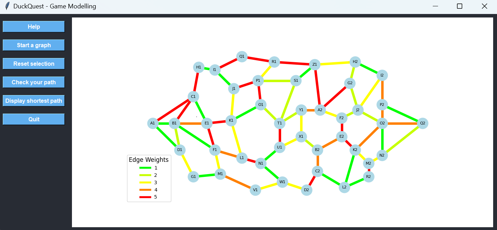

# Duck Quest - Board Game


*"Embark on a journey to teach children algorithmic thinking through a fun and interactive board game!"*

DuckQuest is an educational game created within a school project. It is aimed at young children and allows them to learn to think like an algorithm in order to understand how these work. We achieve this by asking them to find the shortest route through a graph, just as a Dijkstra algorithm would.

## Table of Contents

- [Overview](#overview)
- [Setup](#setup)
- [Installation](#installation)
- [Usage](#usage)
- [Tests](#tests)
- [License](#license)
- [Contact](#contact)

## Overview

### Game Concept
In DuckQuest, the graph is represented as a network of routes around a pond. Children guide a duck along the shortest path using physical buttons for graph nodes and LED strips for graph edges. A Raspberry Pi powers and controls the setup. 

### Example Visualization
Below is a sample graph with nodes and edges:


## Setup

### Graph Edge Colors
The LED strips light up in different colors to represent edge weights:

| Weight         | Color         |
|----------------|---------------|
| 1              | Green         |
| 2              | Bright-Green  |
| 3              | Yellow        |
| 4              | Orange        |
| 5              | Red           |
| Selected Path  | Cyan          |

### Hardware Requirements
To build the DuckQuest board game, you need the following components:

- Complete Raspberry Pi kit

*Not yet implemented :*\
*- Addressable RGB strips (like WS2812).*\
*- Push buttons for nodes.*\
*- Jumper wires and breadboard.*

## Installation

### Prerequisites
Ensure you have the following software installed on your raspberry:

- [Python 3.6+](https://www.python.org/)
- [Git](https://git-scm.com/)
- An active graphical interface (like X11)

### Steps for Installation

1. Clone the repository:
   ```bash
   git clone https://github.com/LeoLeman555/Board_Game_DuckQuest.git
   ```

2. Navigate to the project directory:
   ```bash
   cd ./Board_Game_DuckQuest/
   ```

3. Create a virtual environment (recommended):
   ```bash
   python -m venv venv
   ```

4. Activate the virtual environment:
   - **On Windows**:
   ```bash
   venv\Scripts\activate
   ```
   - **On macOS/Linux**:
   ```bash
   source venv/bin/activate
   ```

5. Install the required dependencies:
   ```bash
   pip install -r requirements.txt
   ```

6. You are fine !

## Tests
### Computer Game Modeling
1. Start the test suite:
   ```bash
   python ./tests/launch_game.py
   ```
2. Interact with the GUI:
   - Press nodes to select the path.
   - Validate your selection to see if it matches the shortest path.
3. Example:



### Raspberry Pi Readiness Checker
Use this script to verify if the Raspberry Pi setup is functional:
   ```bash
   python ./tests/raspberry_pi_checker.py
   ```

- **Features**:
  - Tests internet connectivity.
  - Displays essential system details (CPU, memory, disk usage).


## License
This project is licensed under the MIT License. See the [LICENSE](LICENSE) file for more details.

## Contact

For any questions or feedback, feel free to contact me:
- **Léo Leman** : [My GitHub Profile](https://github.com/LeoLeman555)