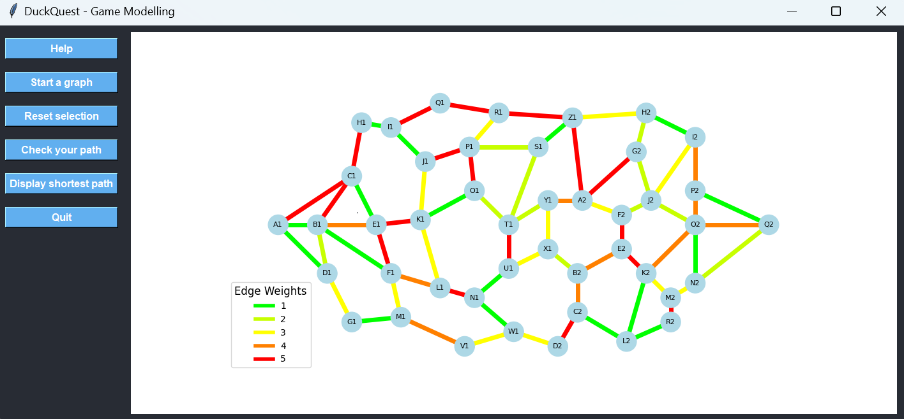

# Testing Documentation

This document provides instructions and guidelines for running automated and manual tests for the DuckQuest project.

## Table of Contents

- [Automated Tests](#automated-tests)
- [Manual UI Test](#manual-ui-test)
- [Hardware Checker](#hardware-checker)
- [Button Checker](#button-checker)
- [LED Strip Checker](#led-strip-checker)

## Automated Tests

The core logic and manager components are tested using `pytest`.

To run the automated test suite (excluding manual UI tests):

```bash
python -m pytest -m "not manual"
```

Pytest will discover all tests in the `tests/` directory. Manual tests are explicitly excluded via markers.

## Manual UI Test

Due to the use of mainloop() in the UI, it cannot be tested automatically.
To launch the game interface manually for visual verification:

```bash
python -m tests.launch_ui
```
This will start the graphical interface. Interact with the GUI:
- Click on nodes to build a path.
- Click on "Validate" to check the shortest path.

Example:



## Hardware Checker

This script tests both the button connected to the Raspberry Pi GPIO and an LED strip. The button press will change the LED strip's color to yellow.

### How to Use

1. Wiring:

- Connect the button to the Raspberry Pi GPIO pin 17 (default) and to GND.
- Connect the LED strip to the Raspberry Pi as follows:

| Raspberry Pi Pin |    LED Strip     |
|------------------|------------------|
| GPIO 18 (pin 12) | Data Input (DIN) |
|	    GND        |       GND        |
|   5V (pin 2/4)   |	VCC (Power)   |

3. Run the script:
```bash
   sudo $(which python) scripts/hardware_checker.py
```
4. Press the button to turn the LED strip yellow. Release it to turn the LEDs off.

### Stopping the Test

Use `CTRL + C` to stop the test. The program will clean up GPIO settings and turn off the LEDs.

### Troubleshooting

If the button or LED strip does not respond as expected during this combined test, consider testing each device separately using the dedicated checker scripts.

## Button Checker

This script allows you to manually verify the functionality of a physical button connected to a Raspberry Pi GPIO pin. It displays real-time feedback in the terminal for each press and release.

### How to Use

1. Wiring:

Connect the button to the Raspberry Pi GPIO pin 17 (default) and to GND.

> The internal pull-up resistor is used; no external resistor is needed.

2. Run the script:
   ```bash
   python scripts/button_checker.py
   ```
3. Press the button

### Example Output

During execution, you will see output like this in the terminal:

```plaintext
Monitoring GPIO pin 17 for button input (Ctrl+C to stop)...
Button pressed.
Button released. Duration: 0.253 seconds
Total presses: 1
```

### Stopping the Test

Use `CTRL + C` to stop the test. The script will clean up the GPIO configuration automatically.

## LED Strip Checker

This script provides manual test patterns for a WS2812 (or compatible) LED strip connected to a Raspberry Pi. It allows full verification of GPIO output, power supply, and LED behavior using multiple visual animations.

### How to Use

1. Wiring:

Connect the LED strip to the Raspberry Pi as follows:

| Raspberry Pi Pin |    LED Strip     |
|------------------|------------------|
| GPIO 18 (pin 12) | Data Input (DIN) |
|	     GND        |       GND        |
|   5V (pin 2/4)   |	   VCC (Power)   |

> For the data pin, ensure you're using the correct direction indicated on the strip (often marked with an arrow or “DATA IN”).

> For long strips, use an external 5V power source (not directly from Pi).

2. Run the script:
   ```bash
   sudo $(which python) scripts/led_strip_checker.py
   ```
3. What the script does:

The script sequentially runs the following animations:

|     Name     |   Description                                                |
|--------------|--------------------------------------------------------------|
|  Color Wipe  |Fills the strip with different solid colors, one LED at a time|
| Theater Chase|Creates a running light effect                                |
|   Rainbow    |Cycles hues smoothly across the entire strip                  |
| Rainbow Cycle|A moving rainbow gradient                                     |
|Theater Chase Rainbow|combines theater chase and rainbow                     |

### Example Output

During execution, you will see output like this in the terminal:

```plaintext
GPIO port used: 18
Number of LEDs: 144
Color wipe animations.
Theater chase animations.
Rainbow animations.
LEDs turned off.
```
### Stopping the Test

Use CTRL + C to interrupt the demo. The script will turn off all LEDs and clean up the GPIO properly.
